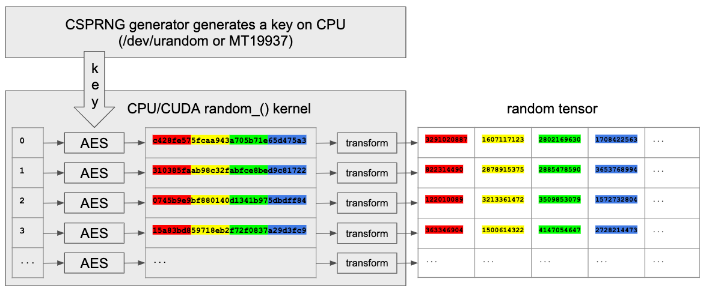

# PyTorch/CSPRNG

CSPRNG is a [PyTorch C++/CUDA extension](https://pytorch.org/tutorials/advanced/cpp_extension.html) that provides [cryptographically secure pseudorandom number generators](https://en.wikipedia.org/wiki/Cryptographically_secure_pseudorandom_number_generator) for PyTorch.

[](https://circleci.com/gh/pytorch/csprng)

## Design

CSPRNG generates a random 128-bits key on CPU using one of its generators and runs
[AES128](https://en.wikipedia.org/wiki/Advanced_Encryption_Standard) in [CTR mode](https://en.wikipedia.org/wiki/Block_cipher_mode_of_operation#Counter_(CTR)) 
mode either on CPU or CUDA to generate random 128 bits state and apply transformation function to map it to target tensor values.
This approach is based on [Parallel Random Numbers: As Easy as 1, 2, 3(John K. Salmon, Mark A. Moraes, Ron O. Dror, and David E. Shaw, D. E. Shaw Research)](http://www.thesalmons.org/john/random123/papers/random123sc11.pdf).
It makes CSPRNG both crypto-secure and parallel on CUDA and CPU.



Advantages:

- A user can choose either seed-based(for testing) or random device based(fully crypto-secure) generators
- One generator instance for both CPU and CUDA tensors(because the encryption key is always generated on CPU)
- CPU random number generation is also parallel(unlike standard PyTorch CPU generator).

## Featues

CSPRNG exposes four methods to create crypto-secure and non-crypto-secure PRNGs:

| PRNG                                                     | Is crypto-secure? | Has seed? | Underlying implementation                                                                                                      |
|----------------------------------------------------------|-------------------|-----------|--------------------------------------------------------------------------------------------------------------------------------|
| create_random_device_generator()                         |         yes       |    no     | [std::random_device](https://en.cppreference.com/w/cpp/numeric/random/random_device) created with default constructor          |
| create_random_device_generator_with_token(token: string) |         yes       |    no     | [std::random_device](https://en.cppreference.com/w/cpp/numeric/random/random_device) created with a token(e.g. "/dev/urandom") |
| create_mt19937_generator()                               |         no        |    yes    | [std::mt19937](https://en.cppreference.com/w/cpp/numeric/random/mersenne_twister_engine) created with default constructor      |
| create_mt19937_generator_with_seed(seed: int)            |         no        |    yes    | [std::mt19937](https://en.cppreference.com/w/cpp/numeric/random/mersenne_twister_engine) created with a seed                   |

The following list of methods supports all forementioned PRNGs:

| Kernel                 | CUDA | CPU |
|------------------------|------|-----|
| random_()              | yes  | yes |
| random_(to)            | yes  | yes |
| random_(from, to)      | yes  | yes |
| uniform_(from, to)     | yes  | yes |
| normal_(mean, std)     | yes  | yes |
| cauchy_(median, sigma) | yes  | yes |
| log_normal_(mean, std) | yes  | yes |
| geometric_(p)          | yes  | yes |
| exponential_(lambda)   | yes  | yes |

## How to build

Since CSPRNG is C++/CUDA extension it uses setuptools, just run `python setup.py install` to build and install it.

## How to use

```python
import torch
import torch_csprng as csprng

# Create crypto-secure PRNG from /dev/urandom:
urandom_gen = csprng.create_random_device_generator_with_token('/dev/urandom')

# Create empty boolean tensor on CUDA and initialize it with random values from urandom_gen:
print(torch.empty(10, dtype=torch.bool, device='cuda').random_(generator=urandom_gen))
tensor([ True, False, False,  True, False, False, False,  True, False, False],
       device='cuda:0')

# Create empty int16 tensor on CUDA and initialize it with random values in range [0, 100) from urandom_gen:
print(torch.empty(10, dtype=torch.int16, device='cuda').random_(100, generator=urandom_gen))
tensor([59, 20, 68, 51, 18, 37,  7, 54, 74, 85], device='cuda:0',
       dtype=torch.int16)

# Create non-crypto-secure MT19937 PRNG:
mt19937_gen = csprng.create_mt19937_generator()

print(torch.empty(10, dtype=torch.int64, device='cuda').random_(torch.iinfo(torch.int64).min, to=None, generator=mt19937_gen))
tensor([-7584783661268263470,  2477984957619728163, -3472586837228887516,
        -5174704429717287072,  4125764479102447192, -4763846282056057972,
         -182922600982469112,  -498242863868415842,   728545841957750221,
         7740902737283645074], device='cuda:0')

# Create crypto-secure PRNG from default random device:
default_device_gen = csprng.create_random_device_generator()

print(torch.randn(10, device='cuda', generator=default_device_gen))
tensor([ 1.2885,  0.3240, -1.1813,  0.8629,  0.5714,  2.3720, -0.5627, -0.5551,
        -0.6304,  0.1090], device='cuda:0')

# Create non-crypto-secure MT19937 PRNG with seed
mt19937_gen = csprng.create_mt19937_generator_with_seed(42)

print(torch.empty(10, device='cuda').geometric_(p=0.2, generator=mt19937_gen))
tensor([ 7.,  1.,  8.,  1., 11.,  3.,  1.,  1.,  5., 10.], device='cuda:0')

print(torch.empty(10, device='cuda').geometric_(p=0.2, generator=mt19937_gen))
tensor([ 1.,  1.,  1.,  6.,  1., 13.,  5.,  1.,  3.,  4.], device='cuda:0')

print(torch.empty(10, device='cuda').geometric_(p=0.2, generator=mt19937_gen))
tensor([14.,  5.,  4.,  5.,  1.,  1.,  8.,  1.,  7., 10.], device='cuda:0')

# Recreate MT19937 PRNG with the same seed
mt19937_gen = csprng.create_mt19937_generator_with_seed(42)

print(torch.empty(10, device='cuda').geometric_(p=0.2, generator=mt19937_gen))
tensor([ 7.,  1.,  8.,  1., 11.,  3.,  1.,  1.,  5., 10.], device='cuda:0')

print(torch.empty(10, device='cuda').geometric_(p=0.2, generator=mt19937_gen))
tensor([ 1.,  1.,  1.,  6.,  1., 13.,  5.,  1.,  3.,  4.], device='cuda:0')

print(torch.empty(10, device='cuda').geometric_(p=0.2, generator=mt19937_gen))
tensor([14.,  5.,  4.,  5.,  1.,  1.,  8.,  1.,  7., 10.], device='cuda:0')

```
